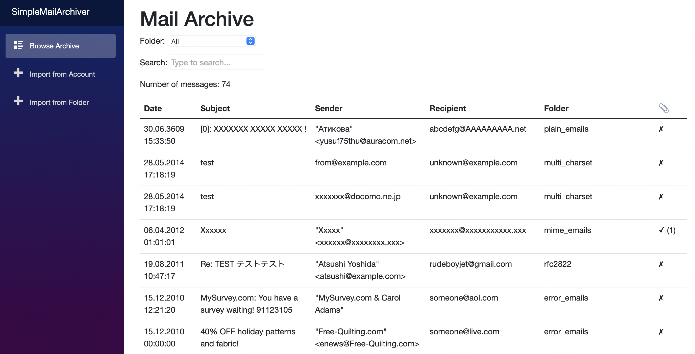
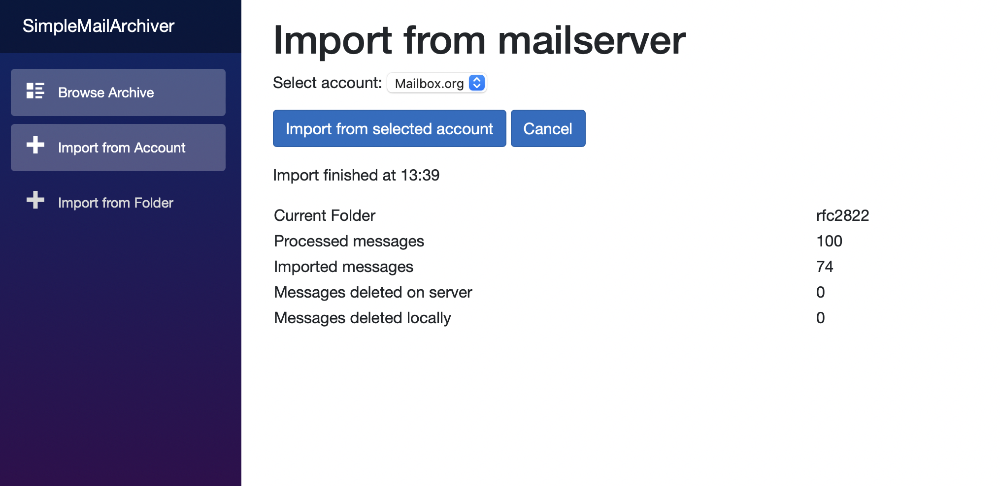
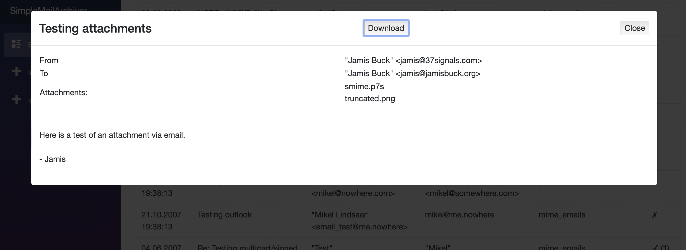

# SimpleMailArchive

A simple web application to backup & archive email from an IMAP server on your own server in an .eml based file structure.

Here are a few screenshots (please excuse the silly test emails, I just used a bunch of mails I found on the internet as test data to cover as many languages etc. as possible)





## How to use
Two options:
- [Docker container](https://hub.docker.com/r/axmeyer/simplemailarchive)
- Clone this repository to build and host the `SimpleMailArchiver.csproj` yourself

### Application Configuration
The application needs four paths as configuration, to be configured either through mounted volumes in the docker container (see the [Docker container page](https://hub.docker.com/r/axmeyer/simplemailarchive) or [`docker-compose.yml example`](example_docker-compose.yml) for reference) or in a [`config.json` (click for sample)](SimpleMailArchiver/SimpleMailArchiver/config.json_sample) file in the applications root folder.

The paths are:
- `ArchiveBasePath`: In this folder, the folder structure of your mail server is mirrored and every email is stored as an `.eml` file. 
- `ImportBasePath`: If you have an existing email archive of some kind, export the emails as `.eml` and place them in this folder. Then they can be imported through the web interface. If you don't need this, you can leave the path empty.
- `AccountConfigsPath`: A folder with `.account` config files to configure the email accounts to import from. Sample file [here](SimpleMailArchiver/SimpleMailArchiver/accounts/JohnDoe_gmail.account_sample)
- `DbPath`: The sqlite database for quick search in the achive will be stored here. Should be a fast drive (e.g. ssd) for good performance.

### Account configuration
An example for the account configuration can be found [here](SimpleMailArchiver/SimpleMailArchiver/accounts/JohnDoe_gmail.account_sample). At least one `.account` file needs to be placed in the `AccountConfigsPath`.

For explanation on what the options do exactly and what their default values are, see [`Account.cs`](SimpleMailArchiver/SimpleMailArchiver/Data/Account.cs) and [`FolderOptions.cs`](SimpleMailArchiver/SimpleMailArchiver/Data/FolderOptions.cs).

For the account configuration, required configuration values are `UserName`, `Password`, `ImapUrl` and `AccountDisplayName`, the rest is optional.

For a `FolderOption`, the `Name` field is required, and at least one other field should be set, otherwise the folder is still processed with the default values. For any folder without specific folder options, the default values are used.

### API
Importing new e-mails from IMAP accounts can be triggered through an API call:

```your-domain/import-api?accountFilename=<account-file>&callBackUrl=<monitoring-url>```

Replace `<account-file>` with the configuration file for the account to be archived, e.g. `john_doe_gmail.account`.

The optional paramater `callBackUrl` allows integration with a service like [healthchecks.io](https://healthchecks.io).

If provided, the following `GET` queries are executed:
- `monitoring_url/start` at the beginning of the import
- `monitoring_url` at successfull completion
- `monitoring_url/fail` in case of failure

Sample for an API call:

```https://simplemailarchive.sampledomain.com/import-api?accountFilename=john_doe_gmail.account&callBackUrl=https://hc-ping.com/uuid-of-the-check```

## FAQ
### What about access restrictions?
Currently, there are no access restrictions implemented. If you want / need access restrictions, I suggest running it behind a reverse proxy like `nginx`
or `traefik` and add access control this way.

### What about SSL?
As with access restrictions, there is nothing directly build into this application at the moment. But running behind a reverse proxy like suggested for the access restrictions also gives you the option to add encryption at this stage.

### How many emails can it handle?
I don't know. I curently have around 18.000 emails in my personal archive and it works just fine and is very responsive. When going into 6 or 7 figures worth of emails, the limiting factor will probably be the sqlite database which can be switched to something more powerfull with little effort. Should you run into problems because of too many emails, just open an issue and I will see what I can do.

### What about multi user support?
Currently, there is no concept of users in the app. You can add multiple accounts to archive from, and if you configure them to go into their own respective folders in the settings, e-mails from specific accounts can be filtered. But there is no way to restrict someone from seeing all emails from all accounts.

For a few users, it is still feasible to just spin up one instance of this app per user. Be aware however that with a large number of mails, the memory footprint of the app can become more significant due to database caching. My personal archive has aorund 18.000 emails at the moment and the running application (as docker container) takes about 400MB of RAM.

### I would like to see feature X
Feel free to open an issue. At the moment, this project is just for my personal use, so I only implement what I need. If there is interest from others (like your reading this) I will see what I can add with reasonable effort.

And if you want to contribute, just start hacking and open a pull request.

# Disclaimer
I do not provide any warranty or other guarantees. If this application somehow makes your computer explode and your house burn down, I am not liable. I am also not liable for any kind of data loss. Use at your own risk.

That said, I wrote this tool mainly for personal use since I needed some solution to archive my emails. Thus I trust it with my own emails (around 18.000 at the time of writing) and it works beautifully in day to day use for me.
